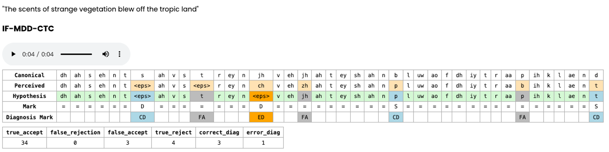
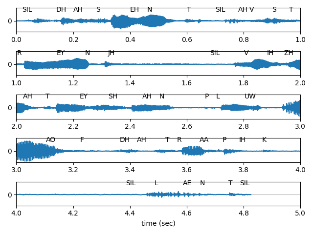

# IF-MDD

Official implementation of:

- [**IF-MDD: Indirect Fusion for Mispronunciation Detection and Diagnosis**](https://github.com/Secondtonumb/Secondtonumb.github.io/blob/main/docs/Geng_ICASSP_2026_final.pdf)
- [**Beyond Acoustic Sparsity and Linguistic Bias: A Prompt-Free Paradigm for Mispronunciation Detection and Diagnosis**](https://arxiv.org/html/2604.22133v1)

For more details, check the demo:
[](https://secondtonumb.github.io/publication_demo/ICASSP_2026/index.html)

## Updates

- `2026-06`: `main` now focuses on the public core research tracks from the new paper: `CROTTC`, `IF-MDD`, `IF + CROTTC`, and `LLM-MDD`.
- `2026-07`: added reproducible L2-ARCTIC CROTTC-IF and Llama-3.2 MDD-LLM release recipes.
- `2025-10`: added timestamp-aware CTC decoding in `inference.py`.
- `2025-10`: released the pretrained CTC checkpoint and inference example.

## Installation

```bash
git clone https://github.com/Secondtonumb/IF-MDD.git
cd IF-MDD
conda create -n ifmdd python=3.10 -y
conda activate ifmdd
pip install -r requirements.txt
```

Notes:

- `MDD-LLM` experiments additionally rely on `accelerate` and `peft` via `requirements.txt`.
- The representative public configs use relative paths by default. For local datasets or pretrained checkpoints outside the repo, pass CLI overrides at launch time.

## Pretrained CTC Inference

Performance on L2-ARCTIC test:

| FRR  | FAR  | ER   | P     | R     | F1    | PER   |
|------|------|------|-------|-------|-------|-------|
| 6.07 | 45.08| 21.25| 60.38 | 54.92 | 57.52 | 14.30 |

```python
from huggingface_hub import hf_hub_download
import importlib.util

path = hf_hub_download(repo_id="Haopeng/CTC_for_IF-MDD", filename="MyEncoderASR.py")
spec = importlib.util.spec_from_file_location("MyEncoderASR", path)
module = importlib.util.module_from_spec(spec)
spec.loader.exec_module(module)

asr_model = module.MyEncoderASR.from_hparams(
    source="Haopeng/CTC_for_IF-MDD",
    hparams_file="inference.yaml",
)
x = asr_model.transcribe_file("./examples/arctic_b0503.wav")
print(x)
```

<mark>For inference with timestamps, please refer [inference.py](./inference.py)</mark>

<details>
<summary>Check the CTC decode result with timestamps</summary>



</details>

## Public Research Tracks

### 1. Original IF-MDD baseline

- Baseline code: `models/phn_mono_ssl_model.py`
- Public baseline config: `hparams/phnmonossl.yaml`

```bash
python train.py hparams/phnmonossl.yaml --feature_fusion=PhnMonoSSL
```

### 2. CROTTC acoustic modeling

- Core model: `models/phn_mono_ssl_model_v3_refactored.py`
- Public config: `hparams/phnmonossl_crottc.yaml`

```bash
python train.py hparams/phnmonossl_crottc.yaml --feature_fusion=PhnMonoSSL
```

### 3. CROTTC-IF sequence model

- IF acoustic model: `models/phn_mono_ssl_model_v3_refactored_IF.py`
- IF sequence model: `models/Trans_IFMDD_ConPCO_ver2.py`
- Public config: `hparams/CROTTC_IF.yaml`

```bash
python train.py hparams/CROTTC_IF.yaml --mode train
```

### 4. MDD-LLM with Llama-3.2

- Primary public LLM model: `models/SSL_LLM_origin_ver2.py`
- Supporting projector: `models/projector.py`
- Public config: `hparams/MDD_LLM_Llama3_2_1B.yaml`

```bash
python train.py hparams/MDD_LLM_Llama3_2_1B.yaml --mode train
```

## L2-ARCTIC Release Bundles

Both release bundles support strict checkpoint loading through `train.py` and
single-audio inference without a repository checkout:

```bash
python -m pip install -U huggingface_hub

hf download Haopeng/CROTTC-IF-l2-arctic \
  --local-dir CROTTC-IF-l2-arctic

hf download Haopeng/MDD-LLM-Llama3.2-1B-L2-ARCTIC \
  --local-dir MDD-LLM-Llama3.2-1B-L2-ARCTIC
```

The CROTTC-IF download includes both `checkpoint/model.ckpt` and
`checkpoint/perceived_ssl.ckpt`. The MDD-LLM download includes its complete
`checkpoint/model.ckpt`.

```bash
export CROTTC_BUNDLE="$PWD/CROTTC-IF-l2-arctic"
python train.py hparams/CROTTC_IF.yaml \
  --mode eval \
  --inference_ckpt "$CROTTC_BUNDLE" \
  --ctc_decode_weight=0.99

python "$CROTTC_BUNDLE/custom_interface.py" \
  --hparams-file hyperparams.yaml \
  --audio examples/arctic_b0503.wav \
  --override ctc_decode_weight=0.99
```

```bash
export LLM_BUNDLE="$PWD/MDD-LLM-Llama3.2-1B-L2-ARCTIC"
python train.py hparams/MDD_LLM_Llama3_2_1B.yaml \
  --mode eval \
  --inference_ckpt "$LLM_BUNDLE"

python "$LLM_BUNDLE/custom_interface.py" \
  --hparams-file hyperparams.yaml \
  --audio examples/arctic_b0503.wav \
  --override 'prompt_system_text=You are a pronunciation evaluator.' \
  --override 'prompt_user_text=Return only the perceived phoneme sequence.'
```

## Public Smoke Matrix

Use the public smoke toolkit to validate the 5 public families:

```bash
bash run_scripts/public_smoke/submit_public_smoke_matrix.sh
```

Families:

- `ifmdd`
- `crottc`
- `phnmonossl_if`
- `trans_ifmdd`
- `mdd_llm_llama3_2`

## Acknowledgements

This implementation is built upon the following repositories:

- [SpeechBrain](https://github.com/speechbrain/speechbrain)
- [MPL-MDD](https://github.com/Mu-Y/mpl-mdd)
- [CTC-Attention-Mispronunciation](https://github.com/cageyoko/CTC-Attention-Mispronunciation)
